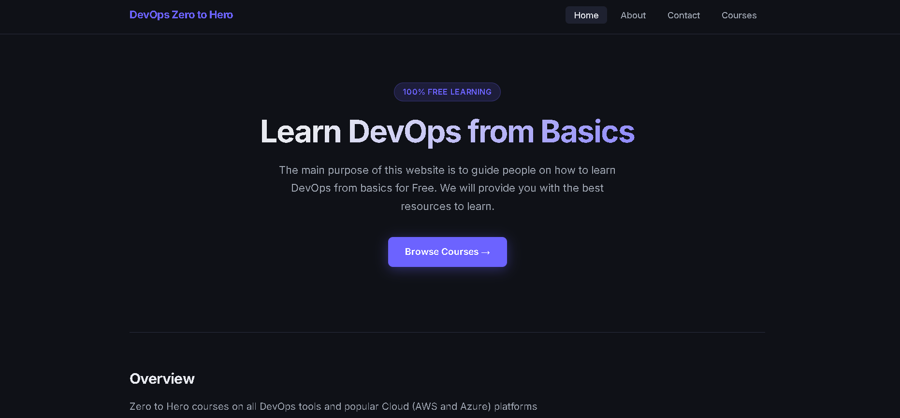

# Golang EKS GitOps Pipeline

> A lightweight, production-ready web application written in **Go (Golang)** — containerized with Docker, deployed on **Amazon EKS**, and delivered via a fully automated **CI/CD pipeline** using GitHub Actions and Argo CD.

[](LICENSE)
[](https://go.dev/dl/)
[](Dockerfile)

---

## 📑 Table of Contents

- [About the Project](#about-the-project)
- [Application Routes](#application-routes)
- [Getting Started](#getting-started)
- [Running Tests](#running-tests)
- [Docker Quick Start](#docker-quick-start)
- [CI/CD Pipeline](#cicd-pipeline)
- [Project Structure](#project-structure)
- [Application Preview](#application-preview)
- [Related Documentation](#related-documentation)
- [License](#license)

---

## About the Project

This project demonstrates a complete **DevOps workflow** for a Go web application. It uses the built-in `net/http` package to serve static HTML pages and is designed to be simple to understand while showcasing real-world DevOps practices including containerization, infrastructure-as-code, and GitOps.

---

## Application Routes

The server exposes four HTTP routes on **port 8080**:

| Route | Page | Description |
|---|---|---|
| `/home` | `static/home.html` | Home / Landing page |
| `/courses` | `static/courses.html` | Courses listing page |
| `/about` | `static/about.html` | About page |
| `/contact` | `static/contact.html` | Contact page |

---

## 🚀 Getting Started

### Prerequisites

Before running the application locally, ensure you have the following installed:

- [Go 1.21+](https://go.dev/dl/)

### Running the Server

From the project root, start the application with:

```bash
go run main.go
```

The server will start on **port 8080**. Open your browser and navigate to any of the routes:

```
http://localhost:8080/home
http://localhost:8080/courses
http://localhost:8080/about
http://localhost:8080/contact
```

---

## 🧪 Running Tests

The project includes unit tests in `main_test.go`. Run them with:

```bash
go test ./...
```

To run with verbose output:

```bash
go test -v ./...
```

---

## 🐳 Docker Quick Start

Build the Docker image locally:

```bash
docker build -t <your-docker-username>/go-web-app .
```

Run the container:

```bash
docker run -p 8080:8080 <your-docker-username>/go-web-app
```

Push the image to Docker Hub:

```bash
docker push <your-docker-username>/go-web-app
```

> 💡 The project uses a **multi-stage Docker build** — the final image is based on `gcr.io/distroless/base` for minimal size and improved security. See the [Dockerfile](Dockerfile) for details.

---

## ⚙️ CI/CD Pipeline

The GitHub Actions workflow ([`.github/workflows/cicd.yaml`](.github/workflows/cicd.yaml)) triggers on every push to `main` (excluding changes to `helm/`, `k8s/`, and `README.md`) and runs the following 4 jobs in sequence:

```
build → push → update-newtag-in-helm-chart
code-quality (runs in parallel with build)
```

| Job | What It Does |
|---|---|
| `build` | Compiles the Go binary and runs all unit tests |
| `code-quality` | Runs `golangci-lint` static analysis |
| `push` | Builds the Docker image and pushes to Docker Hub tagged with the GitHub run ID |
| `update-newtag-in-helm-chart` | Auto-updates the image tag in `helm/go-web-app-chart/values.yaml` and commits back to Git, triggering Argo CD sync |

> 🔑 **Required GitHub Secrets:** `DOCKERHUB_USERNAME`, `DOCKERHUB_TOKEN`, `TOKEN` (GitHub PAT for pushing back to repo)

---

## 📁 Project Structure

```
golang-eks-gitops-pipeline/
│
├── main.go                    # Application entry point — HTTP server with 4 routes
├── main_test.go               # Unit tests
├── go.mod                     # Go module definition (go 1.21)
├── Dockerfile                 # Multi-stage Docker build (golang:1.21 → distroless)
├── LICENSE                    # Apache License 2.0
├── .gitignore
│
├── static/                    # Frontend static HTML pages and assets
│   ├── home.html              # Home page
│   ├── courses.html           # Courses page
│   ├── about.html             # About page
│   ├── contact.html           # Contact page
│   └── images/
│       └── golang-website.png # Application screenshot
│
├── helm/                      # Helm chart for Kubernetes deployment
│   └── go-web-app-chart/
│       ├── Chart.yaml         # Chart metadata (version, appVersion)
│       ├── values.yaml        # Default values (image, replicaCount, ingress)
│       └── templates/
│           ├── _helpers.tpl   # Template helper functions
│           ├── deployment.yaml
│           ├── service.yaml
│           └── ingress.yaml
│
├── k8s/                       # Raw Kubernetes manifests (alternative to Helm)
│   └── manifests/
│       ├── deployment.yaml
│       ├── service.yaml
│       └── ingress.yaml
│
├── eks/                       # Amazon EKS cluster setup guides
│   ├── prerequisites.md       # Required CLI tools setup
│   └── install-eks-cluster.md # Create & manage EKS cluster with eksctl
│
├── gitops/                    # GitOps configuration
│   └── argocd/
│       └── install-argocd.md  # Argo CD installation and UI access
│
├── ingress-controller/        # Ingress controller setup
│   └── nginx/
│       └── install-nginx-ingress-controller.md
│
└── .github/
    └── workflows/
        └── cicd.yaml          # GitHub Actions CI/CD pipeline (4 jobs)
```

---

## 📸 Application Preview



---

## 🔗 Related Documentation

Follow these guides in order to set up the complete infrastructure from scratch:

| Step | Topic | Guide |
|---|---|---|
| 0 | DevOps Pipeline Overview | [README-DevOps.md](README-DevOps.md) |
| 1 | EKS Prerequisites | [eks/prerequisites.md](eks/prerequisites.md) |
| 2 | EKS Cluster Setup | [eks/install-eks-cluster.md](eks/install-eks-cluster.md) |
| 3 | NGINX Ingress Controller | [ingress-controller/nginx/install-nginx-ingress-controller.md](ingress-controller/nginx/install-nginx-ingress-controller.md) |
| 4 | Argo CD Installation | [gitops/argocd/install-argocd.md](gitops/argocd/install-argocd.md) |
| 5 | Architecture Diagrams | [docs/architecture-diagrams.md](docs/architecture-diagrams.md) |

---

## 📄 License

This project is licensed under the **Apache License 2.0**. See the [LICENSE](LICENSE) file for full details.
