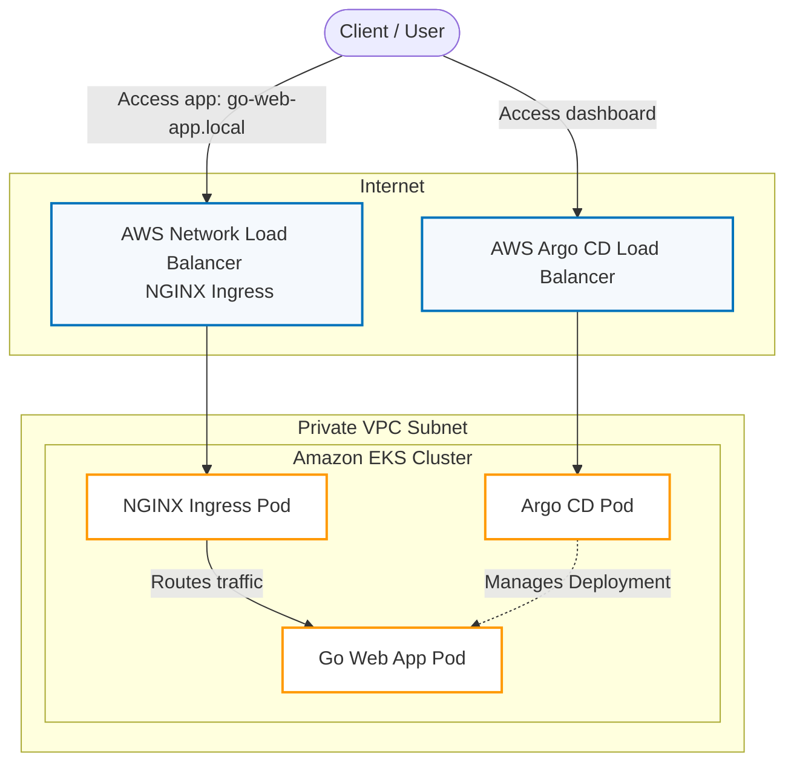
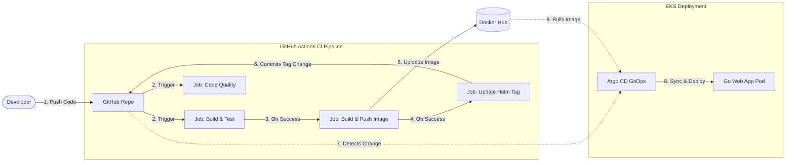

# 📐 Project Architecture Diagrams

This document contains simple and clear architecture diagrams for the **Golang EKS GitOps Pipeline** project. These diagrams cover the AWS cloud infrastructure, the CI/CD pipeline automation, and the internal Kubernetes namespace layout.

---

## ☁️ 1. AWS Architecture Diagram

The AWS infrastructure represents a secure deployment in region `us-east-1`. Ingress traffic from the internet enters via AWS Network Load Balancers and is routed to worker nodes inside a Private VPC subnet.



### Component Summary
- **AWS Network Load Balancers**: Entry points for external traffic, mapping user HTTP requests to the target pods.
- **Private VPC**: Keeps EKS worker nodes isolated from direct internet access for security.
- **Amazon EKS Cluster**: Runs the NGINX Ingress, Argo CD, and the Go web application.

---

## ⚙️ 2. CI/CD Workflow Diagram (GitOps)

This diagram outlines the continuous integration (GitHub Actions) and continuous deployment (Argo CD) pipeline.



### Pipeline Progression
1. **Push**: Developer pushes code to `main`.
2. **CI**: GitHub Actions builds the app, runs tests, and checks code quality (linting).
3. **Publish**: The Docker image is built and uploaded to Docker Hub with a unique tag (run ID).
4. **GitOps Trigger**: The pipeline updates the image tag in the Helm chart and commits it back to Git.
5. **CD**: Argo CD detects the updated Helm chart, pulls the new image from Docker Hub, and deploys it to the cluster.

---

## ☸️ 3. Kubernetes Architecture Diagram

This diagram displays how Kubernetes resources are organized by namespace inside the EKS cluster, and how request traffic reaches the application.

```mermaid
graph TD
    classDef nsIngress fill:#E8F8F5,stroke:#117A65,stroke-width:2px,stroke-dasharray: 5 5;
    classDef nsArgo fill:#FEF9E7,stroke:#D4AC0D,stroke-width:2px,stroke-dasharray: 5 5;
    classDef nsApp fill:#EAF2F8,stroke:#2980B9,stroke-width:2px,stroke-dasharray: 5 5;
    classDef k8sSvc fill:#F4ECF7,stroke:#7D3C98,stroke-width:1.5px;
    classDef k8sPod fill:#FFF,stroke:#34495E,stroke-width:1.5px;

    Client([Client / User])
    AWS_NLB[AWS Network Load Balancer]
    
    subgraph Amazon EKS Cluster
        subgraph ingress-nginx Namespace
            IngressController[NGINX Ingress Controller Pod]:::k8sPod
        end
        
        subgraph default Namespace
            AppIngress[Ingress: go-web-app]
            AppService[Service: go-web-app <br> Type: ClusterIP]:::k8sSvc
            AppPod[Pod: go-web-app <br> Port: 8080]:::k8sPod
        end
        
        subgraph argocd Namespace
            ArgoCD[Argo CD Controller & Server]:::k8sPod
        end
    end
    
    Client -->|go-web-app.local| AWS_NLB
    AWS_NLB --> IngressController
    IngressController -->|Routes by Host header| AppIngress
    AppIngress --> AppService
    AppService --> AppPod
    
    ArgoCD -->|GitOps: Reconcile & Deploy| AppPod
```

### Resource Details
- **`ingress-nginx`**: Handles incoming internet requests and forwards them inside the cluster.
- **`argocd`**: Tracks the Git repository and coordinates deployments.
- **`default` (Application)**:
  - **Ingress**: Defines the host `go-web-app.local` and traffic routing rules.
  - **Service**: Offers a stable cluster-internal IP pointing to the application pods.
  - **Pod**: Runs the Go web app container (listening on port 8080).
