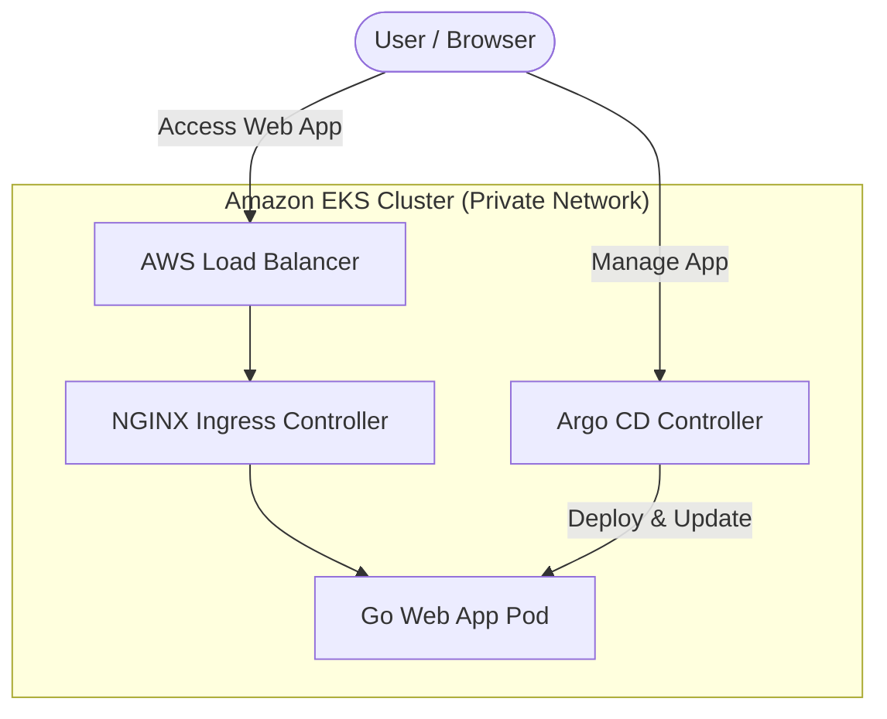
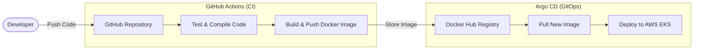
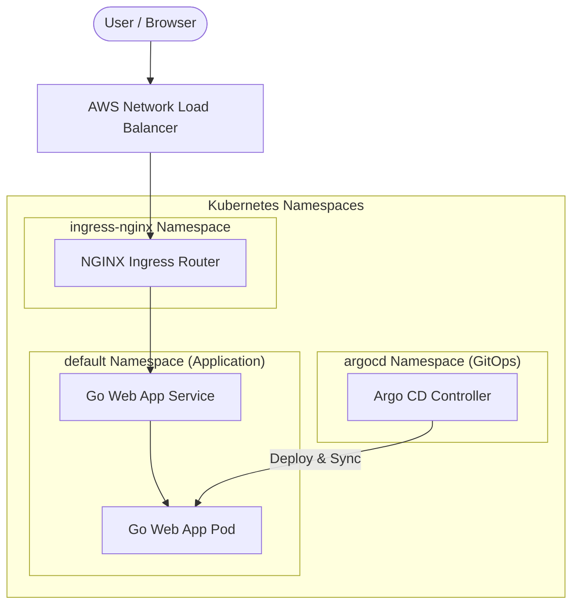

# 📐 Project Architecture Diagrams

This document contains simple, clear, and easy-to-understand architecture diagrams for the **Golang EKS GitOps Pipeline** project.

---

## ☁️ 1. AWS Architecture Diagram

This diagram shows how user traffic enters AWS and is routed to the Go application inside the private network.

### 🔍 Easy-to-Understand Breakdown

#### ➡️ The Simple Traffic Path
`User (Browser)` ──> `AWS Load Balancer` ──> `Ingress (Router) Pod` ──> `Go Web App Pod`

#### 🏢 The Office Complex Analogy
*   **AWS VPC (Private Subnet)** is like a **Highly Secure Corporate Building**. No one can walk straight into the offices without passing security.
*   **AWS NLB (Load Balancer)** is the **Front Gate Security Guard**. They greet visitors and direct them to the lobby.
*   **NGINX Ingress Pod** is the **Lobby Receptionist**. They look at your request (e.g., "I want to visit the web app") and tell you exactly which room to go to.
*   **Go Web App Pod** is the **Office Room** where the workers reside and answer your questions.

#### 🚶 Step-by-Step Traffic Flow
1.  **Request**: You type the app address in your browser.
2.  **Gatekeeper**: AWS Load Balancer receives the request and sends it to the EKS cluster.
3.  **Receptionist**: NGINX Ingress reads the request and forwards it to the Go Web App.
4.  **Response**: The Go App processes the request and sends the website back to your browser.

---

## ⚙️ 2. CI/CD Workflow Diagram (GitOps)

This diagram shows the automated build, test, and release cycle that takes code from a developer's computer to the running cluster.

### 🔍 Easy-to-Understand Breakdown

#### ➡️ The Simple Code Path
`Developer` ──> `GitHub (Code)` ──> `GitHub Actions (Build & Package)` ──> `Docker Hub (Store)` ──> `Argo CD` ──> `EKS Cluster (Deploy)`

#### 🏭 The Toy Factory Analogy
*   **GitHub Repository** is the **Blueprint Office**. When a designer changes the blueprint (code), the factory starts.
*   **GitHub Actions (CI)** is the **Assembly Line & Quality Inspector**. It tests the parts, compiles the toy, packages it into a shipping box (Docker Image), and tags it with a serial number.
*   **Docker Hub** is the **Distribution Warehouse** where finished shipping boxes are stored.
*   **Argo CD (GitOps)** is the **Delivery Agent**. It constantly looks at the blueprints, compares them to the store shelves, and delivers the new box from the warehouse to the store (EKS Cluster) automatically.

#### 🚶 Step-by-Step Pipeline Flow
1.  **Code**: Developer pushes a code update to GitHub.
2.  **Verify**: GitHub Actions compiles the code and runs tests to ensure nothing is broken.
3.  **Package**: The code is packaged into a container image and uploaded to Docker Hub.
4.  **Register**: GitHub Actions writes the new version tag back into Git (Helm chart).
5.  **Deploy**: Argo CD notices the updated tag, pulls the new image from Docker Hub, and replaces the old running app with zero downtime.

---

## ☸️ 3. Kubernetes Architecture Diagram

This diagram shows how resources are organized by "namespaces" (virtual folders) inside the EKS cluster, and how they connect.

### 🔍 Easy-to-Understand Breakdown

#### 🏢 The Department Store Analogy
*   **Namespaces** are like **Departments** in a department store (e.g., Clothing, Electronics, Management). They keep things organized and separated.
    *   `ingress-nginx` is the **Customer Entrance & Escalators**.
    *   `default` is the **Sales Floor** where the main products (Go Web App) live.
    *   `argocd` is the **Manager's Office** behind the scenes.
*   **Ingress** is the **Signpost** directing customers (e.g., "Go to floor 2 for clothing").
*   **Service** is the **Checkout Counter** routing requests to the cashiers.
*   **Pod** is the **Cashier / Worker** who actually does the scanning and serves the customer.

#### 🚶 Step-by-Step Routing Flow
1.  **Entry**: External request comes through the Load Balancer to the **Ingress Controller Pod** (`ingress-nginx` namespace).
2.  **Direction**: The Ingress Controller reads the domain name and passes it to the **Go Web App Service** (`default` namespace).
3.  **Work**: The Service forwards the request to the running **Go Web App Pod** (listening on port 8080) which serves the web page.
