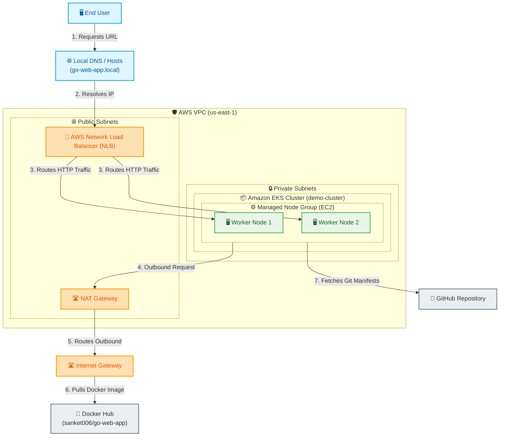
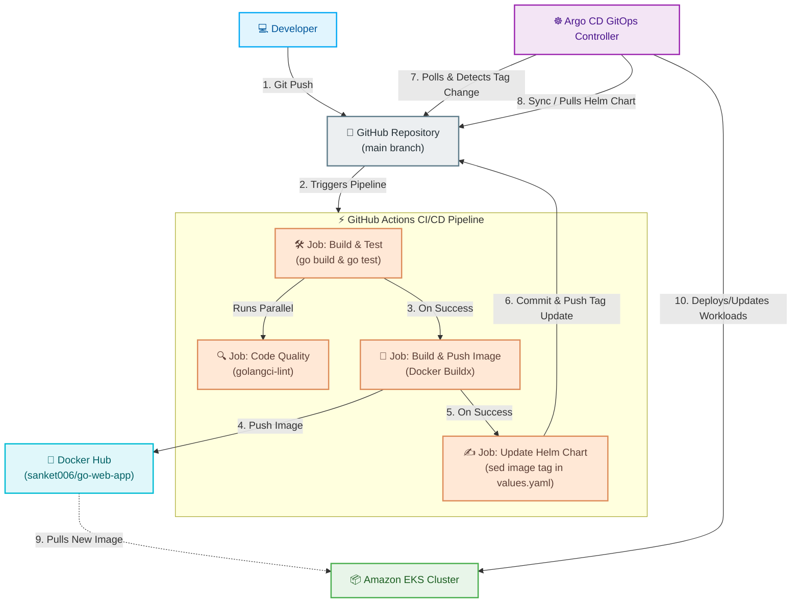
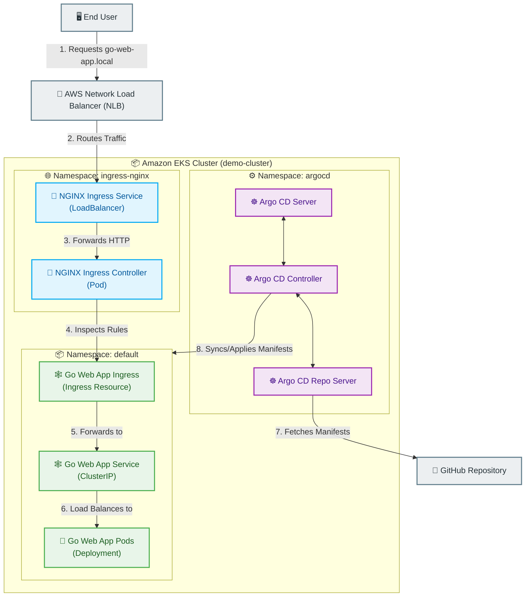

# Architecture Diagrams

> **Navigation:** [Documentation Hub](index.md) | [← Project Overview](01-project-overview.md) | [Full Deployment Walkthrough →](10-full-deployment-walkthrough.md)

---

This document contains detailed, simple, and clear architecture diagrams for the Go Web Application DevOps Pipeline. It covers the AWS Cloud infrastructure, the CI/CD workflow (GitHub Actions & Argo CD), and the internal Kubernetes cluster topology and routing.

---

## 1. ☁️ AWS Cloud Infrastructure Architecture

This diagram shows how the infrastructure is provisioned on AWS, demonstrating the networking setup, external access, and resources residing within public and private subnets.

### 📋 AWS Infrastructure Workflow Explanation

1. **Local DNS Resolution**: The **🖥️ End User** requests `http://go-web-app.local` (1), which resolves locally (2) to the public IP address of the Network Load Balancer (NLB).
2. **Network Load Balancer (NLB)**: The **🔌 AWS NLB** acts as the entry point in the public subnet and routes the inbound HTTP traffic (3) to the worker nodes inside the private subnet.
3. **AWS VPC Isolation**: The worker nodes run inside the **🔒 Private Subnets** for security, with no direct access from the public internet.
4. **Outbound NAT Translation**: Any outbound request (4) originating from the worker nodes is translated by the **🛣️ NAT Gateway** in the public subnet.
5. **Internet Gateway**: The NAT Gateway forwards the outbound traffic through the **🛣️ Internet Gateway** (5) to access the external web.
6. **Docker Hub Registry**: Using the outbound route, the EKS worker nodes pull container images (6) from the external **🐳 Docker Hub** registry.
7. **Git Repository Sync**: The EKS cluster syncs with the **🐙 GitHub Repository** (7) to fetch Helm charts and deployment manifests.

---

## 2. ⚡ CI/CD GitOps Workflow

This diagram represents the step-by-step CI/CD automation pipeline. It covers continuous integration using GitHub Actions and continuous deployment using Argo CD (GitOps approach).

### 📋 CI/CD Pipeline Workflow Explanation

1. **Code Commit**: A **💻 Developer** pushes a code change to the `main` branch of the **🐙 GitHub Repository** (excluding changes in `helm/`, `k8s/`, or `README.md`).
2. **GitHub Actions CI/CD Trigger**: The push triggers the GitHub Actions workflow.
3. **Continuous Integration (CI)**:
   - **🛠️ Build & Test**: Compiles the Go application and runs the unit tests (`go test ./...`).
   - **🔍 Code Quality**: Simultaneously runs static code analysis via `golangci-lint` to enforce style and detect code smell.
4. **Containerization**: Once tests succeed, the pipeline logs into Docker Hub and builds a lightweight, production-ready multi-stage Docker image tagged with the unique GitHub Action run ID.
5. **Docker Registry**: The image is pushed to **🐳 Docker Hub** under `sanket006/go-web-app:<run_id>`.
6. **GitOps Registry Update**: GitHub Actions updates the Helm chart's `values.yaml` in the GitHub repository, replacing the image tag value with the new `<run_id>` and pushing the change back to the repository.
7. **Argo CD Sync**: The **☸️ Argo CD GitOps Controller** (running in EKS) detects the new commit in Git, pulls the updated Helm chart, compares it with the cluster's current state, and pulls the new Docker image from Docker Hub to update the application workloads inside the **📦 Amazon EKS Cluster**.

---

## 3. ☸️ Kubernetes Namespace Topology & Traffic Routing

This diagram details the architecture inside the EKS cluster, illustrating the namespace topology, individual resources, and internal path-based traffic routing.

### 📋 Kubernetes Routing Workflow Explanation

1. **Ingress Entry Point**: External user requests reach the AWS NLB, which forwards them to the **🔌 NGINX Ingress Service** (LoadBalancer) in the `ingress-nginx` namespace.
2. **NGINX Ingress Controller**: The request is passed to the **🔌 NGINX Ingress Controller** Pod, which acts as the cluster reverse-proxy.
3. **Ingress Rule Validation**: The Ingress Controller inspects the **🕸️ Go Web App Ingress** resource in the `default` namespace to resolve the routing rule for `go-web-app.local` at path `/`.
4. **Service Dispatching**: Once the rule matches, the controller forwards the request to the **🕸️ Go Web App Service** (ClusterIP) on port 80.
5. **App Pod Load Balancing**: The Service load balances traffic internally to the active **🐳 Go Web App Pod** (running the containerized Go application on port 8080).
6. **GitOps CD Sync**: Concurrently, the **☸️ Argo CD Controller** running in the `argocd` namespace monitors the git repositories, ensuring that any drift between the Git branch and the running Kubernetes resources is immediately rectified.

---

*[Documentation Hub](index.md) | [← Project Overview](01-project-overview.md) | [Full Deployment Walkthrough →](10-full-deployment-walkthrough.md)*
