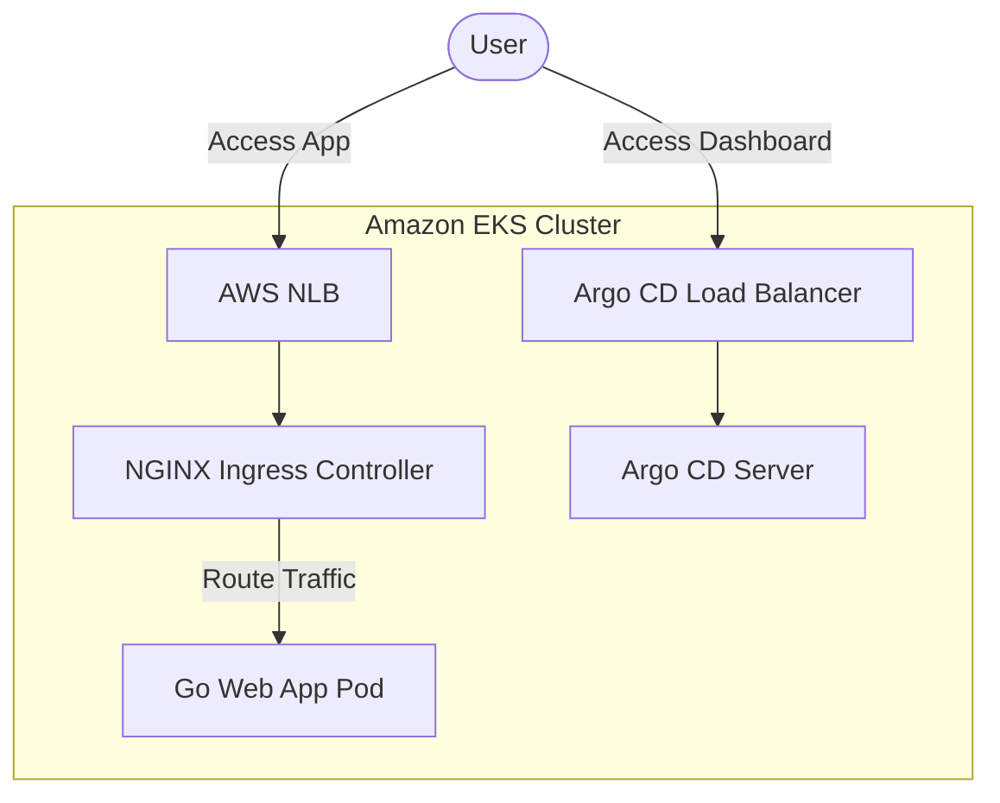
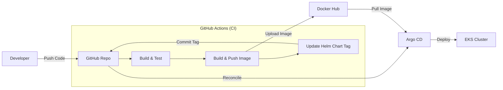
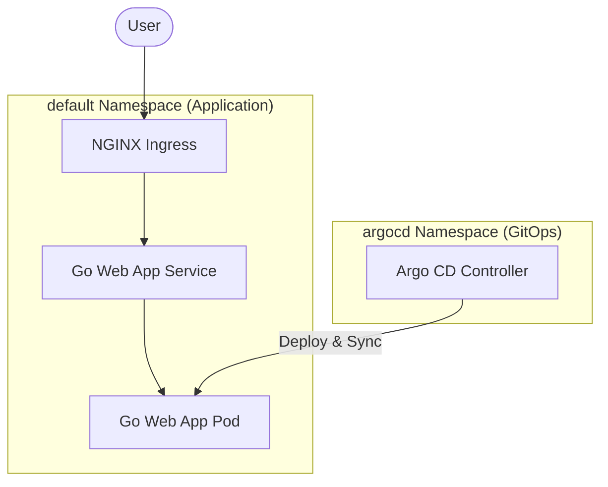

# 📐 Project Architecture Diagrams

This document contains simple and clear architecture diagrams for the **Golang EKS GitOps Pipeline** project.

> ✏️ **Edit These Diagrams**: You can edit these diagrams directly using **[Draw.io](https://app.diagrams.net)** by opening the respective `.drawio` files in the `docs/` folder:
> - ☁️ [AWS Architecture Source File (aws-architecture.drawio)](aws-architecture.drawio)
> - ⚙️ [CI/CD Workflow Source File (cicd-workflow.drawio)](cicd-workflow.drawio)
> - ☸️ [Kubernetes Architecture Source File (k8s-architecture.drawio)](k8s-architecture.drawio)

---

## ☁️ 1. AWS Architecture Diagram

This diagram shows how external traffic enters AWS and is routed to the Go application and Argo CD dashboard inside the private cluster network.

### Traffic Routing Workflow (How Users Access the App)
1. **Request Initiation**: A User enters the address `http://go-web-app.local` in their web browser.
2. **DNS Resolution**: The hostname resolves to the **AWS Network Load Balancer (NLB)** public IP address.
3. **Ingress Entry**: The AWS NLB receives the request on port 80 (HTTP) or 443 (HTTPS) and routes it inside the private network to the **NGINX Ingress Controller Pod** running on EKS.
4. **Path & Host Routing**: The NGINX Ingress Controller inspects the HTTP headers (e.g., Host: `go-web-app.local`) and matches it against the rules in the `go-web-app` Ingress manifest.
5. **Service Forwarding**: Traffic is forwarded to the cluster-internal **Go Web App Service** (Type: `ClusterIP` on port 80).
6. **Pod Target**: The service forwards the traffic to the destination target port `8080` on the **Go Web App Pod**.
7. **Response**: The Go application handles the request (serving pages like `home`, `about`, `courses`, `contact`) and returns the HTML page back to the User.

---

## ⚙️ 2. CI/CD Workflow Diagram (GitOps)

This diagram shows the automated build, test, and release cycle from a code commit to the final deployment.

### GitOps Continuous Deployment Workflow (How Code is Released)
1. **Code Commit**: A Developer pushes a code commit or code fix to the `main` branch of the GitHub repository.
2. **CI Pipeline Trigger**: GitHub Actions automatically triggers the `CI/CD` workflow.
3. **Build & Test**: GitHub Actions runs the `build` job (compiling the Go binary and running tests) and the `code-quality` job (running `golangci-lint`) in parallel.
4. **Publish Image**: Once tests pass, the `push` job builds a Docker container image using a secure, multi-stage build and uploads it to **Docker Hub** tagged with the unique GitHub Action `run_id`.
5. **Helm Chart Update**: The `update-newtag-in-helm-chart` job edits the `helm/go-web-app-chart/values.yaml` file, updating the image tag to match the new `run_id`, and commits this change back to the repository.
6. **GitOps Detection**: The **Argo CD Application Controller** in the EKS cluster detects that the repository's target state has updated (the Helm tag has changed).
7. **Reconciliation & Deployment**: Argo CD triggers an automatic Sync, pulls the corresponding new Docker image from Docker Hub, and performs a rolling update on EKS with zero downtime.

---

## ☸️ 3. Kubernetes Architecture Diagram

This diagram displays the namespace separation and service-to-pod routing layout inside EKS.

### Component Details
- **NGINX Ingress**: Directs incoming requests based on routing rules.
- **Go Web App Service**: Acts as a stable internal load balancer for the application pods.
- **Argo CD Controller**: Continuously syncs the application pods with the Git repository's Helm chart.
