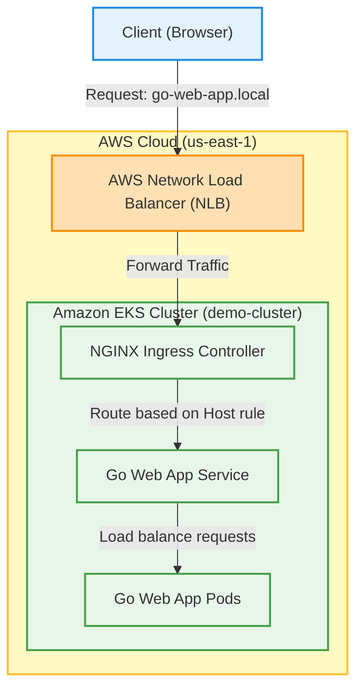
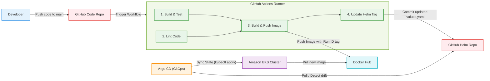
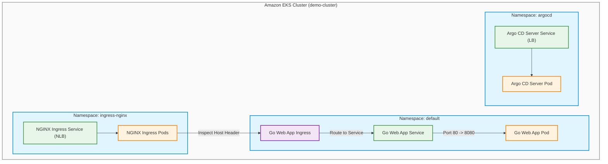

# Architecture Diagrams & Workflows

This document provides a detailed visual representation and workflow explanation for the three main sub-systems of the Go Web Application DevOps pipeline:
1. **AWS Infrastructure Architecture** (Traffic routing from the Client to the EKS Cluster)
2. **CI/CD Workflow** (Continuous Integration & GitOps Continuous Deployment Pipeline)
3. **Kubernetes Cluster Topology** (Namespace separation, Services, and Pods)

---

## ☁️ 1. AWS Architecture Diagram

The following diagram illustrates how external client traffic enters the AWS Cloud environment and reaches the web application running in Amazon EKS.

### Traffic Flow Workflow
1. **Domain Resolution**: The Client resolves the domain name `go-web-app.local` directly to the IP address of the AWS Network Load Balancer (NLB). This resolution bypasses Route 53 and is handled via local hosts configuration or local DNS resolution.
2. **Edge Entry**: Traffic reaches the **AWS Network Load Balancer (NLB)** on port 80/443.
3. **Cluster Entrance**: The NLB routes external TCP traffic to the active **NGINX Ingress Controller** pods inside the EKS cluster.
4. **Ingress Rule Matching**: The Ingress Controller inspects the HTTP `Host` header (`go-web-app.local`) and matches it with the rules defined in the Ingress manifest.
5. **App Redirection**: Traffic is forwarded internally to the **Go Web App ClusterIP Service** (port 80).
6. **Backend Execution**: The Kubernetes Service distributes the traffic across the running **Go Web App Pods** (listening on container port 8080).

---

## ⚙️ 2. CI/CD Workflow Diagram (GitOps)

The following diagram shows the end-to-end continuous integration and deployment pipeline, from the developer's push to the final rolling update in EKS.

### Pipeline Workflow
1. **Developer Action**: A developer pushes code changes (excluding helm/k8s/docs paths) to the `main` branch on GitHub.
2. **Trigger**: GitHub Actions starts the CI/CD workflow runner.
3. **Continuous Integration (CI)**:
   - **Build & Test**: Compiles the Go binary and runs unit tests (`go test ./...`).
   - **Lint**: Runs `golangci-lint` to check code style and detect bugs.
4. **Build & Push Image**: After checks succeed, a multi-stage Docker image is built and pushed to **Docker Hub** using the unique GitHub Run ID (`${{github.run_id}}`) as the image tag.
5. **Declarative Tag Update**: The workflow automatically updates the `tag` field in `helm/go-web-app-chart/values.yaml` using a `sed` command and pushes the changes back to the repository.
6. **Continuous Delivery (CD)**:
   - **Drift Detection**: **Argo CD** detects that the active cluster state differs from the desired Git state (new Helm tag).
   - **Sync & Deploy**: Argo CD applies the updated Helm configuration to the **Amazon EKS Cluster**.
   - **Rolling Update**: The EKS nodes pull the newly tagged image from **Docker Hub** and perform a zero-downtime rolling update.

---

## ☸️ 3. Kubernetes Namespace & Architecture Diagram

The following diagram illustrates the deployment topology inside the Amazon EKS cluster, showing the namespace segregation and resource configurations.

### Namespace Topology Workflow
1. **Namespace Isolation**: Resources are separated into logical zones for security, governance, and traffic control:
   - **`ingress-nginx` namespace**: Houses the ingress proxy engine.
   - **`argocd` namespace**: Houses the GitOps automation controllers.
   - **`default` namespace**: Houses the Go web application resources.
2. **Ingress Controller Service**: Exposes NGINX externally as a Network Load Balancer. It handles external requests and sends them to the **NGINX Ingress Pods**.
3. **Application Ingress Rules**: An Ingress resource configured for host `go-web-app.local` watches the HTTP host header and maps traffic to the application's service.
4. **App Service (ClusterIP)**: The internal **Go Web App Service** routes traffic from port `80` to target port `8080` of the application pods.
5. **App Pod**: The running application container receives the request and returns the static pages (`home.html`, `about.html`, etc.).
6. **Argo CD UI Access**: The **Argo CD Server Service** is patched to type `LoadBalancer` to expose the Argo CD administrative control panel dashboard externally.
